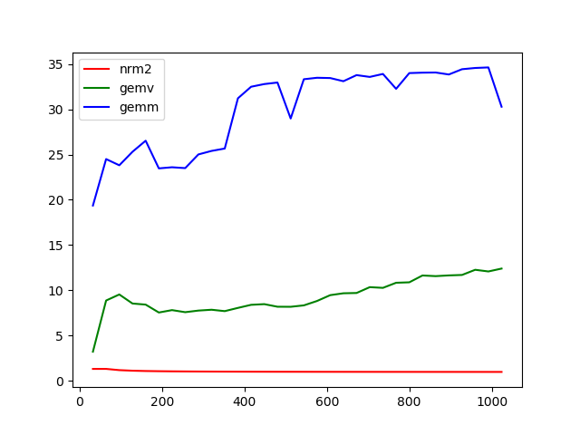

SCML 2018 Exercise 1
====================

The code `ex1.cpp` contains the naive implementations of required functions.
One can change `test_sizes` in code to change test problems, use `make` to
compile. Also a Ruby script provided to visualize the performance results,
use `make plot` to run and generate performance figure.

Problem Analysis
====================

1. Norm

    The computational complexity is aobut O(2 * size).

2. Matrix-vector product

    The computational complexity is about O(2 * size^2).

3. Matrix-matrix multiplication

    The computational complexity is about O(2 * size^3).

Hardware Limits
====================

The CPU I used is Intel(R) Xeon(R) CPU E5-2650 v4 @ 2.20GHz, which has
`2.2 * 1 * 16 = 35.2` GFLOPs for each core.

Performance Results
====================

The performance result figure is plotted as below, the red line is the result
for `nrm2`, green line is for `gemv`, blue line is for `gemm`. Since I supports
`lda` and `incx` in my implementation, my plotting script also include these
extra computations in computing total complexity.

