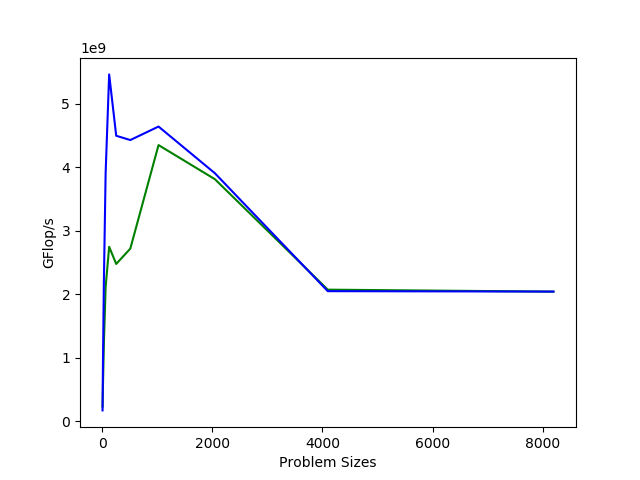

HPSC 2018 Exercise 2
====================

The code `ex2.cpp` contains the naive implementations of required functions.
One can change `test_sizes` in code to change test problems, use `make` to
compile. Also a Ruby script provided to visualize the performance results,
use `make plot` to run and generate performance figure.

Problem Analysis
====================

The computational cost of LU factorization is about O(2n/3) where n is the
row/column dimension of the matrix.

Performance Results
====================

I've tried my LU implementation on random generated matrices in various sizes,
the performance result is as below. The green line is LU factorization without
pivoting and the blue one is with pivoting.

