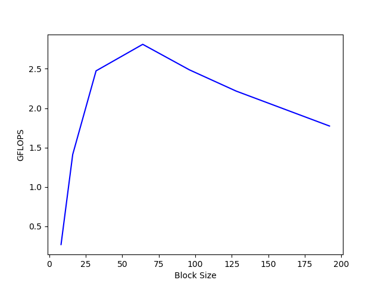
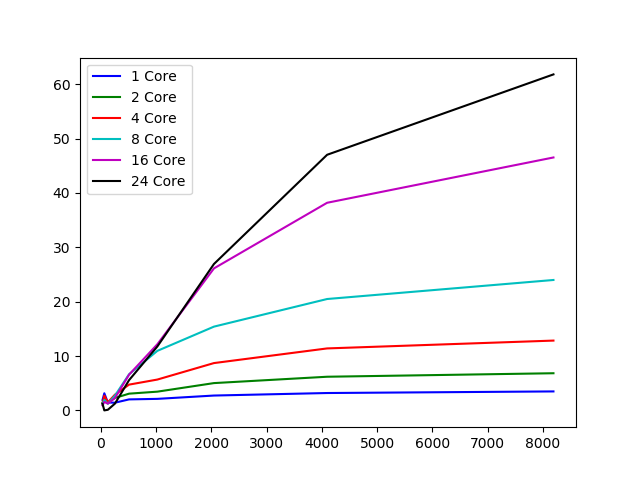

SCML 2018 Exercise 3
====================

I have implemented block LU and measured the performance.

### The performance with different block sizes

The result shows that when the block size is 64, the performance is
better than any other block sizes I have tested.

### The performance with different number of threads

The x-axis is the problem size, the y-axis is performance in GFLOPS.
