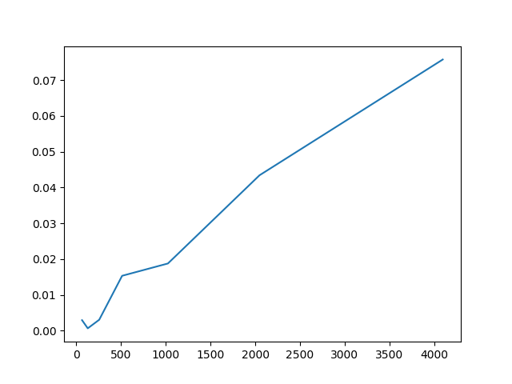
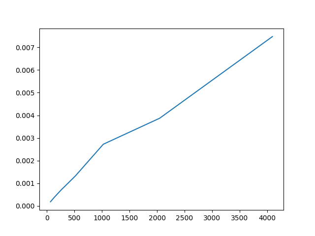
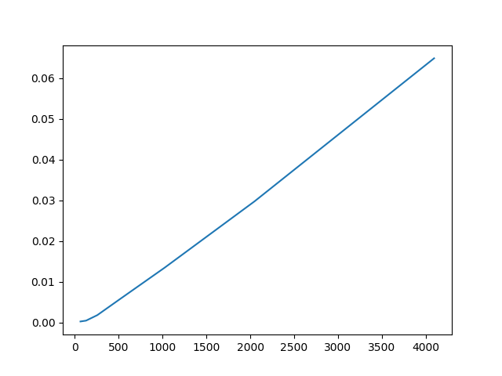

SCML 2018 Exercise 4
====================

Problem Analysis
====================

The full matrix to CSR format will use following kernels:

  1. Count non-zero values in each row.

    * There is `size^2` reads from global memory and `size + 1` writes.

  2. Exclusive scan to build row pointer.

    * Work-efficient scan algorithm is implemented.

    * The number of read and write is about `4 * size`.

  3. Copy column index and non-zero values.

    * The number of reads is `size^2` and number of writes is `2 * nnz`.

Performance Results
====================

I've measure the memory bandwidth for each kernels. The x-axis
is the input matrix size and y-axis is the global memory access
bandwidth in GB/s.

The bandwidth of non-zero counting kernel.

The bandwidth of exclusive scan kernel.

The bandwidth of value copying kernel.

We can see the bandwidth increases while the problem size is increasing. We may
need to test on larger problems to see what will happen.
