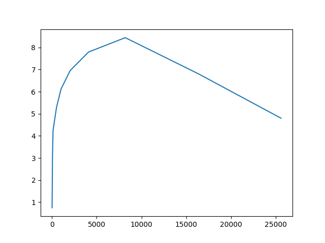
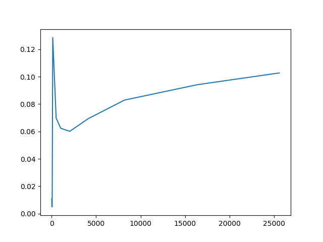

SCML 2018 Exercise 6
====================

I've test the tranfer rate of MPI in different packet sizes. The bandwidth
is as the figure below.

In this figure, I tested the bandwidth on one node.

In this figure, I tested the bandwidth across two nodes.

